# ALBANIAN_MODULE_DEPENDENCY_MAP

## Scope

This document maps the Albanian GF module structure as represented in the uploaded Albanian codedump and reinforced by the audit runs. It is intended to be the working dependency map for editing, debugging, and documenting the Albanian concrete syntax.

The map is organized by layers rather than by alphabetical file order, because Albanian modules are tightly interrelated and most editing errors come from crossing category boundaries between layers.

## Reading conventions

- **Foundation module** = defines shared types, records, params, or constructors used widely below the syntax surface.
- **Core syntax module** = concrete syntax for one abstract grammar area.
- **Aggregator** = combines modules without introducing much new logic.
- **API wrapper** = user-facing convenience layer over the grammar.
- **Structural resource** = lexical/function-word support module used by structural grammar.

Dependency arrows should be read as:

- `A -> B` means **A depends on B**.
- If a module is written as `X = A, B, C ** {}`, it is an **aggregator** over those modules.
- If a module is written as `X = Y with (...)`, it is a **parameterized wrapper/adaptation** over another module.

## High-level architecture

The Albanian tree is best understood as seven layers:

1. **Base resources and category definitions**
2. **Morphology and paradigms**
3. **Core concrete syntax modules**
4. **Structural vocabulary resources**
5. **Aggregators and exposed language modules**
6. **API wrappers and convenience resources**
7. **Debug/test/support files**

## Top-level dependency graph

```mermaid
graph TD
  ResSqi --> CatSqi
  CatSqi --> MorphoSqi
  ResSqi --> MorphoSqi
  MorphoSqi --> ParadigmsSqi
  CatSqi --> ParadigmsSqi
  ResSqi --> ParadigmsSqi

  CatSqi --> NounSqi
  MorphoSqi --> NounSqi
  ResSqi --> NounSqi

  CatSqi --> AdjectiveSqi
  ResSqi --> AdjectiveSqi

  CatSqi --> VerbSqi
  ResSqi --> VerbSqi

  CatSqi --> NumeralSqi
  CatSqi --> SentenceSqi
  ResSqi --> SentenceSqi
  CatSqi --> QuestionSqi
  ResSqi --> QuestionSqi
  CatSqi --> RelativeSqi
  ResSqi --> RelativeSqi
  CatSqi --> PhraseSqi
  ResSqi --> PhraseSqi
  CatSqi --> AdverbSqi
  ResSqi --> AdverbSqi
  CatSqi --> ConjunctionSqi
  ResSqi --> ConjunctionSqi
  CatSqi --> IdiomSqi
  ResSqi --> IdiomSqi
  CatSqi --> ConstructionSqi
  ResSqi --> ConstructionSqi
  CatSqi --> DocumentationSqi
  ResSqi --> DocumentationSqi
  CatSqi --> SymbolSqi
  ResSqi --> SymbolSqi
  ParadigmsSqi --> SymbolSqi
  CatSqi --> ExtraSqi
  ResSqi --> ExtraSqi

  ResSqi --> StructuralSqiRes
  CatSqi --> StructuralSqiRes
  ParadigmsSqi --> StructuralSqiNominal
  ResSqi --> StructuralSqiNominal
  StructuralSqiRes --> StructuralSqiNominal
  ParadigmsSqi --> StructuralSqiVerbal
  ResSqi --> StructuralSqiVerbal
  CatSqi --> StructuralSqiVerbal
  ParadigmsSqi --> StructuralSqiClause
  ResSqi --> StructuralSqiClause
  CatSqi --> StructuralSqiClause

  StructuralSqiNominal --> StructuralSqi
  StructuralSqiVerbal --> StructuralSqi
  StructuralSqiClause --> StructuralSqi
  CatSqi --> StructuralSqi

  NounSqi --> GrammarSqi
  AdjectiveSqi --> GrammarSqi
  NumeralSqi --> GrammarSqi
  VerbSqi --> GrammarSqi
  SentenceSqi --> GrammarSqi
  QuestionSqi --> GrammarSqi
  RelativeSqi --> GrammarSqi
  ConjunctionSqi --> GrammarSqi
  IdiomSqi --> GrammarSqi
  TextSqi --> GrammarSqi
  PhraseSqi --> GrammarSqi

  CatSqi --> LexiconSqi
  ParadigmsSqi --> LexiconSqi

  GrammarSqi --> LangSqi
  LexiconSqi --> LangSqi

  CatSqi --> SyntaxSqi
  ResSqi --> SyntaxSqi
  NounSqi --> SyntaxSqi
  AdjectiveSqi --> SyntaxSqi
  PhraseSqi --> SyntaxSqi
  StructuralSqi --> SyntaxSqi

  SyntaxSqi --> ConstructorsSqi
  SyntaxSqi --> TrySqi
  LexiconSqi --> TrySqi
  ParadigmsSqi --> TrySqi

  GrammarSqi --> SymbolicSqi
  SymbolSqi --> SymbolicSqi

  CatSqi --> ExtendSqi
  ResSqi --> ExtendSqi
  ExtraSqi --> AllSqi
  LangSqi --> AllSqi
```

## Layer 1. Base resources and category definitions

### `albanian/ResSqi.gf`
Role:
- foundational resource layer
- defines reusable low-level types and helpers used nearly everywhere

Key responsibilities:
- defines `Compl`
- aliases `Prep` to `Compl`
- defines shared parameters such as `Species`
- provides `mkCompl`, `mkPrep`, and `noPrep`

Why it matters:
- this is the semantic and structural floor for many Albanian record types
- category mismatches in higher layers often trace back to misunderstanding `ResSqi` helpers

### `albanian/CatSqi.gf`
Role:
- concrete category and lincat definition layer for Albanian

Key responsibilities:
- maps abstract categories to Albanian record shapes
- defines the shapes of `N`, `N2`, `A`, `A2`, `V`, `Prep`, etc.

Why it matters:
- this file fixes the actual record shape of nearly every category used elsewhere
- every higher-level implementation should be checked against this file before introducing new record literals

### `albanian/TenseSqi.gf`
Role:
- tense/polarity/anteriority support module

Notes:
- more isolated than most Albanian modules
- belongs close to the foundational layer because it defines key record shapes for tense-related categories

## Layer 2. Morphology and paradigms

### `albanian/MorphoSqi.gf`
Depends on:
- `CatSqi`
- `ResSqi`
- `Predef`
- `Prelude`

Role:
- morphology engine for Albanian nouns and related inflectional builders
- defines large families of `mkN...` constructors and inflection tables

Why it matters:
- this is the central morphology resource
- if `NounSqi` is the syntax-level noun module, `MorphoSqi` is where much of its shape and inflectional behavior originates

### `albanian/ParadigmsSqi.gf`
Depends on:
- `MorphoSqi`
- `CatSqi`
- `ResSqi`
- `Predef`
- `Prelude`

Role:
- paradigm and smart-constructor layer over morphology
- exposes practical constructors such as noun, verb, adjective, determiner, pronoun, and quantifier builders

Why it matters:
- this is the standard lexical entry point for modules such as `LexiconSqi`, `NamesSqi`, `TrySqi`, and structural resources
- many cross-module naming and type conflicts seen in audit logs occur here, because `ParadigmsSqi` opens both `CatSqi` and `ResSqi`

### `albanian/IrregSqi.gf`
Depends on:
- `ParadigmsSqi`

Role:
- irregular-forms extension over paradigms

### `albanian/NamesSqi.gf`
Depends on:
- `CatSqi`
- `ParadigmsSqi`

Role:
- stock proper names and place names

## Layer 3. Core concrete syntax modules

These correspond most directly to the major abstract grammar components.

### Grammar backbone

#### `albanian/NounSqi.gf`
Depends on:
- `CatSqi`
- `MorphoSqi`
- `ResSqi`
- `Prelude`

Role:
- noun syntax
- determiners, pronouns, quantifiers, and noun phrase assembly

#### `albanian/AdjectiveSqi.gf`
Depends on:
- `CatSqi`
- `ResSqi`
- `Prelude`
- `Predef`

Role:
- adjective syntax
- adjectival agreement and AP behavior

#### `albanian/VerbSqi.gf`
Depends on:
- `CatSqi`
- `ResSqi`
- `Prelude`

Role:
- verb syntax and verbal surface realization

#### `albanian/NumeralSqi.gf`
Depends on:
- `CatSqi`
- `ParamX`
- `Prelude`

Role:
- numeral formation and related number-sensitive structures

#### `albanian/SentenceSqi.gf`
Depends on:
- `CatSqi`
- `ResSqi`
- `Prelude`

Role:
- clausal and sentence-level composition

#### `albanian/QuestionSqi.gf`
Depends on:
- `CatSqi`
- `ResSqi`
- `Prelude`

Role:
- question syntax

#### `albanian/RelativeSqi.gf`
Depends on:
- `CatSqi`
- `ResSqi`
- `Prelude`

Role:
- relative-clause syntax

#### `albanian/PhraseSqi.gf`
Depends on:
- `CatSqi`
- `Prelude`
- `ResSqi`

Role:
- utterance- and phrase-level packaging layer

#### `albanian/ConjunctionSqi.gf`
Depends on:
- `CatSqi`
- `Coordination`
- `ResSqi`
- `Prelude`

Role:
- coordination layer
- defines list categories such as `ListNP`, `ListCN`, `ListAP`, etc.

Why it matters:
- this is the key list/coordination module used implicitly by many higher modules
- the inherited `ListNP` shape is especially important for `ExtendSqi`

#### `albanian/AdverbSqi.gf`
Depends on:
- `CatSqi`
- `ResSqi`
- `Prelude`

Role:
- adverbial and preposition-adjacent surface behavior

#### `albanian/IdiomSqi.gf`
Depends on:
- `CatSqi`
- `ResSqi`
- `Prelude`

Role:
- idiomatic clausal and NP constructions

#### `albanian/ConstructionSqi.gf`
Depends on:
- `CatSqi`
- `ResSqi`
- `Prelude`
- `Predef`
- `ParamX`

Role:
- construction-specific helpers and convenience syntax not limited to one narrow category family

#### `albanian/DocumentationSqi.gf`
Depends on:
- `CatSqi`
- `ParamX`
- `ResSqi`
- `Prelude`
- `HTML`

Role:
- grammar documentation/output support

#### `albanian/TextSqi.gf`
Depends on:
- `CatSqi`
- `Prelude`

Role:
- text-level punctuation and text assembly

#### `albanian/SymbolSqi.gf`
Depends on:
- `CatSqi`
- `Prelude`
- `Predef`
- `ParamX`
- `ResSqi`
- `ParadigmsSqi`

Role:
- symbolic/number-text interface

#### `albanian/ExtraSqi.gf`
Depends on:
- `CatSqi`
- `Prelude`
- `ResSqi`

Role:
- extra grammar layer with non-core helpers and additional constructions

#### `albanian/ExtendSqi.gf`
Depends on:
- `CatSqi`
- `ExtendFunctor`
- `Prelude`
- `Predef`
- `ResSqi`
- `ParamX`

Role:
- the high-risk extension/override layer for `Extend`
- customizes or replaces selected `ExtendFunctor` behavior

Why it matters:
- this is the most fragile Albanian module in the audit history
- it sits late in the dependency chain and therefore reflects assumptions from many lower layers
- edits here must be checked against `CatSqi`, `ResSqi`, `ConjunctionSqi`, and `ExtendFunctor`

## Layer 4. Structural vocabulary resources

Albanian structural material is intentionally split into subresources, then re-exported.

### `albanian/StructuralSqiRes.gf`
Depends on:
- `Prelude`
- `ParamX`
- `ResSqi`
- `CatSqi`

Role:
- low-level structural helpers
- constant NP and related structural constructors

### `albanian/StructuralSqiNominal.gf`
Depends on:
- `Prelude`
- `ParamX`
- `ResSqi`
- `ParadigmsSqi`
- `StructuralSqiRes`

Role:
- determiners, quantifiers, pronouns, and NP-side structural items

### `albanian/StructuralSqiVerbal.gf`
Depends on:
- `Prelude`
- `ParamX`
- `ResSqi`
- `CatSqi`
- `ParadigmsSqi`

Role:
- structural verbal vocabulary and compile-safe fallback verbs

### `albanian/StructuralSqiClause.gf`
Depends on:
- `Prelude`
- `ParamX`
- `CatSqi`
- `ResSqi`
- `ParadigmsSqi`

Role:
- prepositions, conjunction-like items, clause-level structural vocabulary, adverbials

### `albanian/StructuralSqi.gf`
Depends on:
- `CatSqi`
- `StructuralSqiNominal`
- `StructuralSqiVerbal`
- `StructuralSqiClause`

Role:
- main structural aggregator
- re-exports the nominal, verbal, and clause structural resources as one `Structural` concrete syntax

Why it matters:
- this is the structural “join point” used by `SyntaxSqi`
- edits to clause/preposition behavior often belong in the structural subresources, not in `ExtendSqi`

## Layer 5. Aggregators and exposed language modules

### `albanian/GrammarSqi.gf`
Role:
- core grammar aggregator

Composed from:
- `NounSqi`
- `AdjectiveSqi`
- `NumeralSqi`
- `VerbSqi`
- `SentenceSqi-[sep]`
- `QuestionSqi-[sep]`
- `RelativeSqi`
- `ConjunctionSqi`
- `IdiomSqi`
- `TextSqi`
- `PhraseSqi`

Why it matters:
- this is the canonical “grammar without lexicon” surface
- it is the primary dependency that user-facing modules inherit as `Grammar = GrammarSqi`

### `albanian/LexiconSqi.gf`
Depends on:
- `CatSqi`
- `ParadigmsSqi`

Role:
- Albanian lexicon entries built with Albanian paradigms

### `albanian/LangSqi.gf`
Role:
- main language entry point

Composed from:
- `GrammarSqi`
- `LexiconSqi`

Why it matters:
- this is the concrete `Lang` module for Albanian
- user-facing whole-language compilation typically flows through `LangSqi`

### `albanian/AllSqiAbs.gf`
Role:
- minimal abstract aggregator over `Lang`

### `albanian/AllSqi.gf`
Role:
- concrete top-level aggregator over `LangSqi`

## Layer 6. API wrappers and convenience resources

### `SyntaxSqi.gf`
Depends on:
- `Prelude`
- `Predef`
- `CatSqi`
- `ResSqi`
- `NounSqi`
- `AdjectiveSqi`
- `PhraseSqi`
- `StructuralSqi`

Role:
- API-style constructor layer
- exposes convenience constructors like `mkCN`, `mkAP`, `mkDet`, `mkNP`

Why it matters:
- this is the clean user-facing syntax layer for building Albanian terms without working directly in every concrete syntax module

### `ConstructorsSqi.gf`
Depends on:
- `SyntaxSqi`

Role:
- restricted constructor surface over `SyntaxSqi`
- removes selected pronouns and quantifiers from direct exposure

### `TrySqi.gf`
Depends on:
- `SyntaxSqi`
- `LexiconSqi`
- `ParadigmsSqi`

Role:
- experimentation shell for building terms quickly from syntax + lexicon + paradigms

### `SymbolicSqi.gf`
Depends on:
- `Symbol`
- `SymbolSqi`
- `GrammarSqi`

Role:
- symbolic wrapper binding generic symbolic grammar to Albanian symbol and grammar modules

## Layer 7. Test and support files

### `albanian/TestAbs.gf`
Role:
- tiny local abstract test file

### `albanian/TestSqi.gf`
Depends on:
- `CatSqi`
- `ParadigmsSqi`

Role:
- tiny local concrete test

### `albanian/gf_dryrun_patch.py`
Role:
- tooling/support script
- not part of the grammar dependency graph proper

## Canonical dependency paths

These are the most important real edit paths.

### Noun path
`ResSqi -> CatSqi -> MorphoSqi -> ParadigmsSqi -> NounSqi -> GrammarSqi -> LangSqi`

Use this path when debugging:
- noun record shape
- determiners and quantifiers
- noun morphology
- lexical noun entries

### Structural path
`ResSqi/CatSqi -> StructuralSqiRes/StructuralSqiNominal/StructuralSqiVerbal/StructuralSqiClause -> StructuralSqi -> SyntaxSqi`

Use this path when debugging:
- function words
- determiners and pronouns supplied structurally
- prepositions
- clause-level particles
- convenience constructors that rely on structural vocabulary

### Extension path
`ResSqi + CatSqi + ConjunctionSqi/ListNP assumptions + ExtendFunctor -> ExtendSqi`

Use this path when debugging:
- extension constructors
- RNP/RNPList behavior
- CN/AP/Comp mismatch issues
- cases where a category shape is inherited from the functor rather than defined locally in one Albanian module

### User-facing path
`GrammarSqi + LexiconSqi -> LangSqi -> AllSqi`

Use this path when debugging:
- whole-language availability
- “why does this constructor exist in grammar but not in the top-level language?”
- user entry points and packaging

## Module responsibilities by stability

### Most stable / foundational
- `ResSqi`
- `CatSqi`
- `MorphoSqi`
- `ParadigmsSqi`

These should change rarely and only with strong evidence.

### Core but editable
- `NounSqi`
- `AdjectiveSqi`
- `VerbSqi`
- `SentenceSqi`
- `QuestionSqi`
- `RelativeSqi`
- `ConjunctionSqi`
- `PhraseSqi`
- `IdiomSqi`
- `ConstructionSqi`
- `TextSqi`
- `SymbolSqi`
- `DocumentationSqi`
- `ExtraSqi`

### High-risk override layer
- `ExtendSqi`

### Structural vocabulary maintenance layer
- `StructuralSqiRes`
- `StructuralSqiNominal`
- `StructuralSqiVerbal`
- `StructuralSqiClause`
- `StructuralSqi`

### Packaging / API layer
- `GrammarSqi`
- `LexiconSqi`
- `LangSqi`
- `AllSqi`
- `SyntaxSqi`
- `ConstructorsSqi`
- `TrySqi`
- `SymbolicSqi`

## Audit-aligned notes

The audit runs enumerate a broad Albanian module set that matches this layered map: core grammar modules, structural split resources, packaging modules such as `GrammarSqi` and `LangSqi`, and high-risk modules such as `ExtendSqi`. That audit evidence supports treating the language as a connected system rather than as isolated files. In particular, the later audit runs clearly include `ParadigmsSqi`, `PhraseSqi`, `QuestionSqi`, `RelativeSqi`, `ResSqi`, `SentenceSqi`, `StructuralSqi`, `StructuralSqiClause`, `StructuralSqiNominal`, `StructuralSqiRes`, `StructuralSqiVerbal`, `SymbolSqi`, and `TenseSqi` together in one compile surface. 

## Editing guidance derived from the dependency map

1. When changing category shapes, start at `CatSqi` and `ResSqi`, not in higher modules.
2. When changing inflection logic, check `MorphoSqi` before `NounSqi` or `LexiconSqi`.
3. When changing lexical builders, check `ParadigmsSqi` before editing many lexicon entries individually.
4. When changing function words, check the structural split resources before editing `SyntaxSqi` or `ExtendSqi`.
5. When debugging top-level availability, walk upward through `GrammarSqi -> LangSqi -> AllSqi`.
6. When debugging convenience constructors, walk through `SyntaxSqi` and then downward into the concrete modules it opens.
7. When debugging `ExtendSqi`, validate every assumption against `CatSqi`, `ResSqi`, `ConjunctionSqi` list shapes, and `ExtendFunctor`.

## Recommended companion docs

This dependency map should be read together with:
- `ALBANIAN_LANGUAGE_ARCHITECTURE.md`
- `ALBANIAN_CATEGORY_AND_LINCAT_REFERENCE.md`
- `ALBANIAN_OVERRIDE_AND_INHERITANCE_POLICY.md`
- `ALBANIAN_IMPLEMENTATION_PATTERNS.md`
- `ALBANIAN_FORBIDDEN_PATTERNS_AND_ANTI_DRIFT_RULES.md`

## Source basis

Primary source basis for this dependency map:
- Albanian codedump snapshot
- Albanian audit runs and artifact indexes
- GFCodex lookup rules for checking signatures by exact function/module/type
- German and Bulgarian model-language material for cross-checking subsystem organization where helpful
